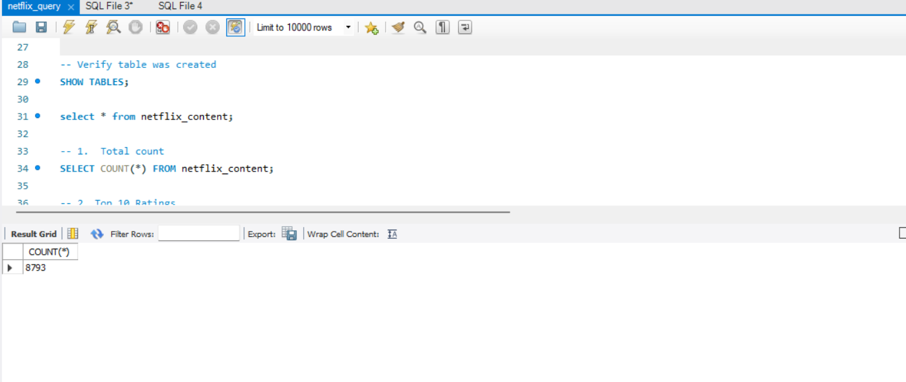
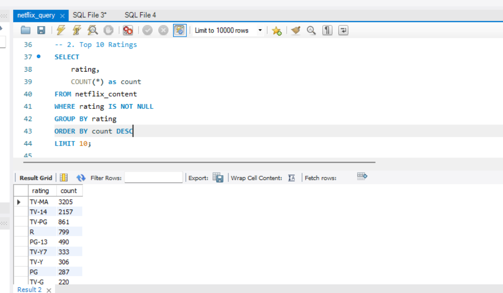
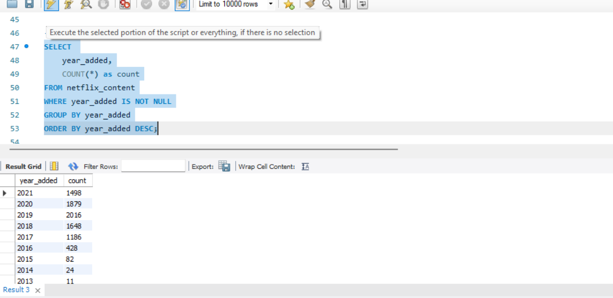
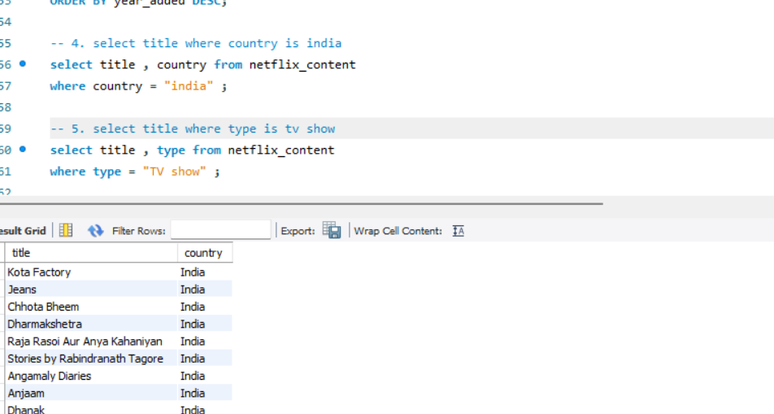
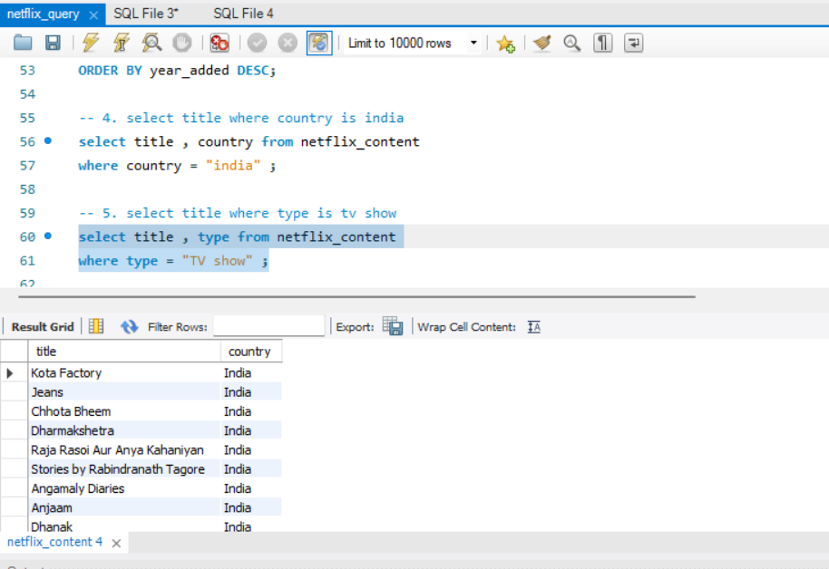
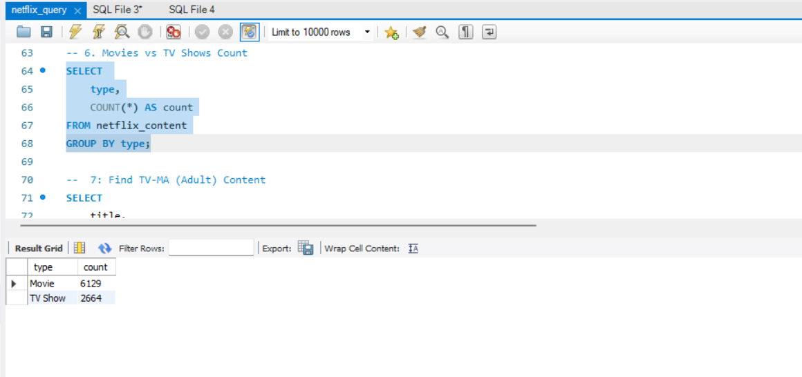
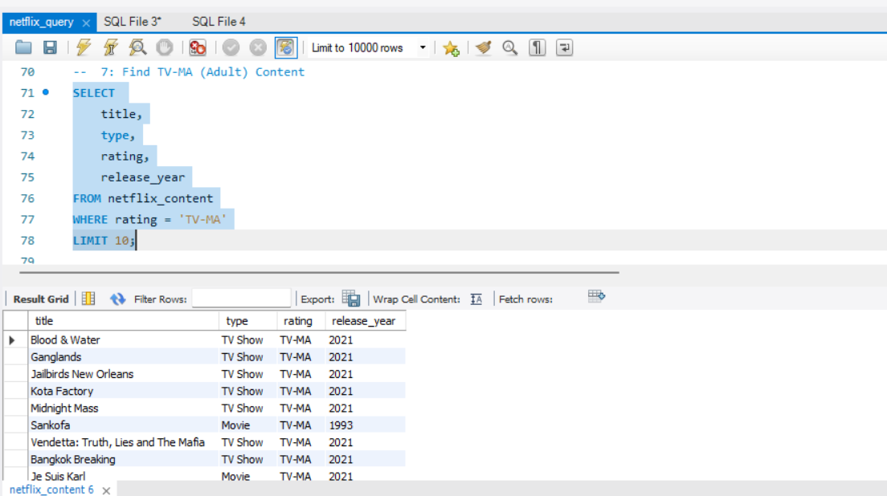
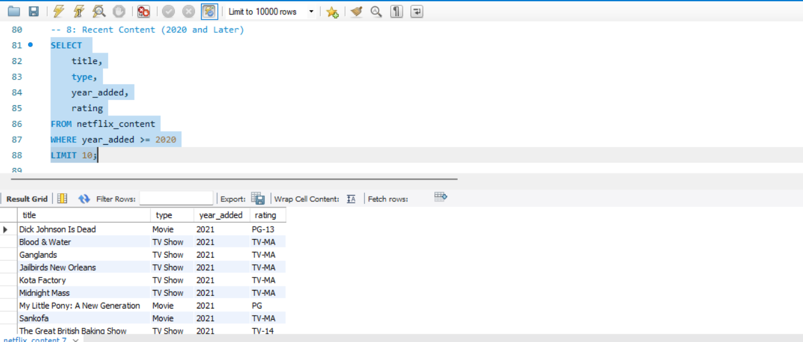
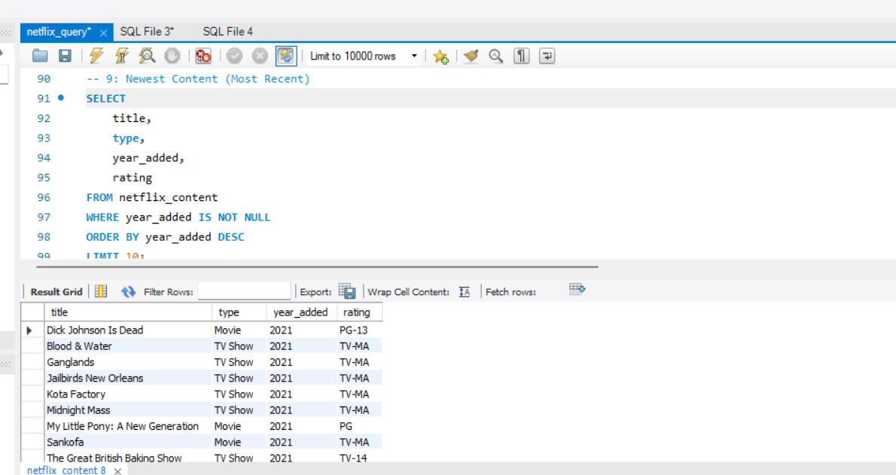
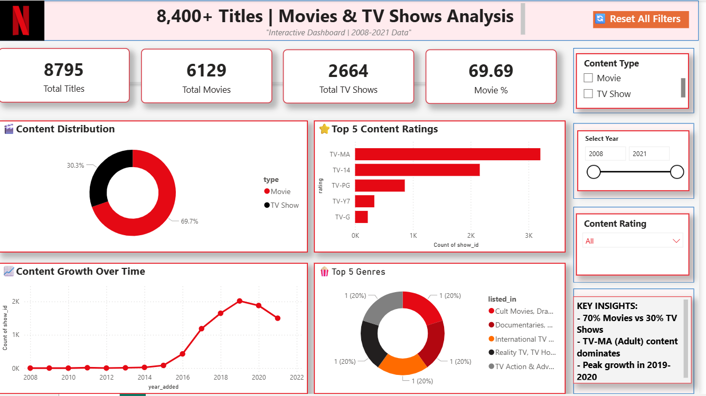

# 🎬 Netflix Content Analysis — SQL + Power BI Project

---

## 📌 Project Overview

This project analyzes Netflix's content library (2008–2021) using **MySQL** for data exploration and **Power BI** for building an interactive dashboard. The goal was to uncover patterns in content type, ratings, genres, and growth trends across 8,700+ titles.

---

## 📂 Dataset

| Column | Description |
|--------|-------------|
| `show_id` | Unique ID for each title |
| `type` | Movie or TV Show |
| `title` | Name of the content |
| `director` | Director name |
| `cast` | Cast members |
| `country` | Country of production |
| `date_added` | Date added to Netflix |
| `release_year` | Year of release |
| `rating` | Content rating (TV-MA, PG-13, etc.) |
| `duration` | Duration in minutes or seasons |
| `listed_in` | Genre categories |
| `year_added` | Derived year from date_added |
| `month_added` | Derived month from date_added |

- **Total Titles:** 8,793
- **Movies:** 6,129
- **TV Shows:** 2,664
- **Data Range:** 2008 – 2021

---

## 🔍 SQL Queries Performed

### 🔹 Basic Queries
- Total content count — **8,793 titles**
- Select all content from the database
- Filter titles by country (India)
- Filter content by type (TV Show)

### 🔹 Aggregation & Grouping
- Top 10 content ratings by count (TV-MA leads with 3,205)
- Content added per year (GROUP BY year_added)
- Movies vs TV Shows count (6,129 Movies vs 2,664 TV Shows)

### 🔹 Filtering & Sorting
- TV-MA (Adult) content — filtered with WHERE clause
- Recent content added in 2020 and later
- Newest content ordered by year_added DESC

---

## 📸 SQL Query Screenshots

### 1. Total Count (8,793 titles)

### 2. Top 10 Ratings

### 3. Content Added by Year

### 4. Indian Content Filter

### 5. Indian Content Filter (TV Show type)

### 6. Movies vs TV Shows Count

### 7. TV-MA Adult Content

### 8. Recent Content (2020+)

### 9. Newest Content

---

## 📊 Power BI Dashboard

### 🔢 KPI Cards
- Total Titles — **8,795**
- Total Movies — **6,129**
- Total TV Shows — **2,664**
- Movie % — **69.69%**

### 📈 Visuals
- **Content Distribution** — Donut chart (69.7% Movies vs 30.3% TV Shows)
- **Top 5 Content Ratings** — Bar chart (TV-MA dominates with 3,205 titles)
- **Content Growth Over Time** — Line chart (peak growth in 2019–2020)
- **Top 5 Genres** — Donut chart by listed_in categories
- **Filters** — Content Type slicer, Year range slider, Content Rating dropdown

---

## 📸 Dashboard Screenshot

---

## 💡 Key Insights

- Netflix content grew rapidly from **2016 onwards** — peak in **2019–2020**
- **TV-MA** is the most common rating with **3,205 titles** — adult content dominates
- **Movies (69.7%)** significantly outnumber TV Shows (30.3%)
- **2020** had the highest additions with **1,879 titles**
- Strong presence of **Indian content** — Kota Factory, Chhota Bheem, and more

---

## 🛠️ Tools Used

- **MySQL** — Database creation, table setup, and 9 SQL queries
- **Power BI** — Interactive dashboard with KPIs, slicers, and 4 visuals
- **SQL Concepts** — SELECT, WHERE, GROUP BY, ORDER BY, LIMIT, IS NOT NULL

---

## 📁 Files in This Repository

| File | Description |
|------|-------------|
| `netflix_cleaned.csv` | Cleaned dataset used for analysis |
| `netflix_query.sql` | All 9 SQL queries |
| `dashboard.png` | Power BI dashboard screenshot |
| `ss1.png` – `ss9.png` | SQL query result screenshots |
| `README.md` | Project documentation |

---

## 👩‍💻 Author

**Taniya Jain**
MBA Student | Aspiring Data Analyst
[LinkedIn](https://www.linkedin.com/in/taniya-jain-542118229) • [GitHub](https://github.com/Tani0310)
